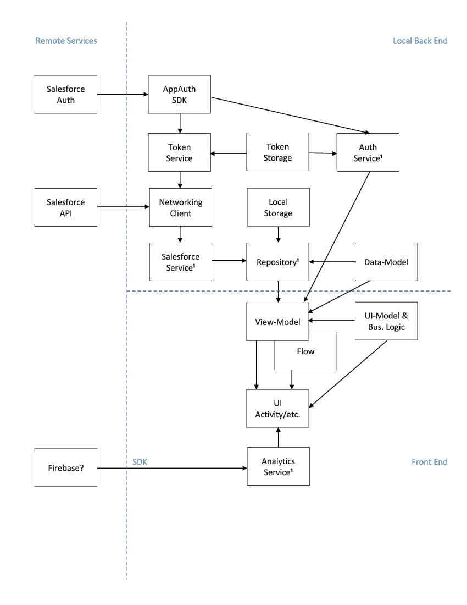

# BiWF

This document describes the setup and patterns used by this project implementing the Android app for BiWF.

[TOC levels=2-5]: # "Table of Contents"

# Table of Contents
- [Building](#building)
- [Configurations](#configurations)
- [Environments](#environments)
- [Jenkins](#jenkins)
  - [Jenkins Configuration](#jenkins-configuration)
- [JIRA](#jira)
- [Architecture and Patterns](#architecture-and-patterns)
  - [Architecture Component Dependency Diagram](#architecture-component-dependency-diagram)
  - [Patterns](#patterns)
    - [MVVM with Flows](#mvvm-with-flows)
    - [Railway Oriented Programming](#railway-oriented-programming)
    - [Dependency Injection](#dependency-injection)
    - [UI Bindings](#ui-bindings)
  - [Authorization Flow](#authorization-flow)
  - [Offline Behavior and Caching](#offline-behavior-and-caching)
- [Code Structure](#code-structure)
  - [Packages](#packages)
  - [Third Party Libraries](#third-party-libraries)
  - [Custom Primitive Types](#custom-primitive-types)
- [Style Guidelines](#style-guidelines)
- [Linting](#linting)
- [Notes](#notes)

## Building
Building this project locally on a development environment does not need any special configuration. Import the project into Android Studio and let it sync. A plain build after that is enough.

## Configurations
Currently, there are no special build types or build flavors. It has the two standard build types `debug` and `release`.

## Environments
Currently, there is only one environment and it is configured in the `defaultConfig` of the build.gradle file by the `rootUrl`, `clientId`, `scope`, `redirectUrl` and `baseUrl` variables.

## Jenkins
CI/CD is performed by a Jenkins instance that can be found here:

[Jenkins Android Builds](https://build.intrepid.digital.accenture.com/job/Centurylink/job/centurylink-android/)

The project uses a Jenkins Declarative Pipeline for continuous integration. It runs on ACN's build servers under the `Centurylink-android` job. The build is controlled via this project's `Jenkinsfile`. This same configuration setup handles new builds when the master branch updates and test builds of pull requests.

### Jenkins Configuration
See this project's `Jenkinsfile`. Lint, test-results, code-coverage and SonarQube results are published.

## JIRA
This project JIRA board can be found here:

[JIRA BiWF](https://ctl.atlassian.net/secure/RapidBoard.jspa?rapidView=2269&projectKey=BMA)

## Architecture and Patterns
### Architecture Component Dependency Diagram
The diagram below give an overal overview of the various component types
in the app and how they depend on each other.

<!--
This PNG can be regenerated from this link: https://ts.accenture.com/sites/CenturyLink-BiWFMobile/_layouts/15/Doc.aspx?OR=teams&action=edit&sourcedoc={7A1AAF75-644A-4A5A-BC5E-E97857D040F9}, modifying the diagram and getting a screen-capture)
-->


###### Local Back End
- **AppAuth SDK**  
  Provides OAuth authorization and remote (access/refresh) token management.
- **Token Service**  
  Provides local token services (get token, refresh token, update token, etc.).
- **Token Storage**  
  Provides secure local storage for token and authorization state.
- **Auth Service**  
  Provides authentication (sign in and logout) services. This is only used for log-in and log-out screens. Can be mocked or easily be replaced by implementations that always emit either failure or success.
- **Networking Client**  
  Provides communication, through HTTP(S), to remote web services such as the Salesforce API or to a local Mock Integraion Server. On Android we’ll use RetroFit and OkHttp for this client’s implementation.
- **Local Storage**  
  Provides local caching of data in local storage or memory. This component type will be used sparingly since most data will not be cached.
- **Salesforce Service**  
  Provides access to a particular set of remote Salesforce APIs. For tests or dummy-data replacements, a Mock Integration Server can be used instead to provide test-data or dummy-data to the Repositories.
- **Repository**  
  Provides access and aggregates data from a particular Salesforce Service. For tests or dummy-data replacements, Data-Model instances could be generated and handled on-the-fly, bypassing the Salesforce Services. Provides some business logic related to business processes. Provides caching strategies, if any.
- **Data-Model**  
  Models the data returned from a Repository and data to be provided to a Repository.

###### Front End
- **ViewModel and Flow**  
  Handles Repositories at the request of the UI. Translates Data-Models into UI-Models and vice versa. Provides UI-Model data to and from the UI. Provides a navigator/coordinator that instructs the UI to move to a different view or screen. Coroutine `Flow`s with lifecycle-aware scopes adds Android lifecycle awareness to the View-Model’s data emissions. All code in a `ViewModel` must run in the Main UI Thread. Any code that needs to run in the background must run in a Repository or Service.
- **UI-Model**  
  Models the data to be used in a particular UI component. Provides business logic to **validate** the data from the **UI**.
- **Analytics Service**  
  Records screen transitions and user-events.
- **UI**  
  The actual UI, such as Activities, Fragments, Views, etc.

### Patterns
#### MVVM with Flows
Each `Activity` or `Fragment` has its own `ViewModel`. The `ViewModel` closely models its UI (`Activity` or `Fragment`). It is basically a 'testable' UI.

A UI observes incoming UI-Model changes by observing properties of its associated `ViewModel`. If the `Activity` or `Fragment` implements `LiveDataObserver`, that should look something like this:
```kotlin
    viewModel.invoices.observe {
        invoicesAdapter.submitList(it)
    }
```
or
```kotlin
    viewModel.errorEvent.observe {
        ErrorDialogFragment(it.title, it.message).show()
    }
```
or
```kotlin
    viewModel.navState.observeWith(invoiceListCoordinator)
```

and a `ViewModel` exposes it observable properties as `Flow`s to the UI. here is an example.
```kotlin
class InvoiceViewModel(   ): BaseViewModel() {
    
    val invoices: Flow<UiInvoicesList> = BehaviorFlow()
    val emptyScreen: Flow<UiNoData> = BehaviorFlow()
    val errorEvent = EventFlow<UiErrorInfo>()
    val navState = EventFlow<InvoiceDestinations>()
    
    init {
        viewModelScope.launch {
            requestInvoiceData()
        }
    }
   
    suspend fun requestInvoiceData() {
        emptyScreen.latestValue = UiNoData.Loading
        
        repository.getInvoices()
            .map { it.toUiInvoiceList() }
            .mapLeft { it.toUiNoData() }
            .fold(
                { emptyScreen.latestValue = it },
                { invoices.latestValue = it }
            )
    }
    
    fun onPayCtaPressed(val invoiceId: String) {
        viewModelScope.launch {
            repository.payInvoice(invoiceId)
                .mapLeft { it.toUiErrorInfo() }
                .fold(
                    { errorEvent.latestValue = it },
                    { navState.latestValue = InvoiceDestinations.BACK }
                )
        }
    }
}
```
In most cases, there are two types of `Flow`s for a ViewModel's observable property:
- For **Data** to render on the screen: A `Flow` backed by a `BehaviorFlow`
- For (navigation) **Events**: An `EventFlow`.

#### Railway Oriented Programming

Do not throw exceptions from functions in **Repository** components and try to avoid the same in **Service** component functions (eg Retrofit can return `Either` types, but other Services may not able to do so).

Instead, return an `Either` type that either carries particular error or carries the desired result.

###### Creating a `Either` from an Exception
```kotlin
    val result: Either<SomeError, SomeResult> = try {
        Either.Right(api.getSomeData(input))
    } catch (e: FileNotFoundException) { // Be very specific in catching exceptions!
        Either.Left(SomeError.FileDoesNotExist)
    } catch (e: IncorrectFileFormat) { 
        Either.Left(SomeError.NotAPdfFile)
    }
```

###### Changing the Result of an `Either` (`map`)
```kotlin
    val result: Either<InvoicesError, Invoices> = repo.getInvoices()
    val uiResult: Either<InvoicesError, UiInvoiceList> = result.map { it.toUiResult() }
```

###### Changing the Error of an `Either` (`mapLeft`)
```kotlin
    val result: Either<InvoicesError, Invoices> = repo.getInvoices()
    val uiError: Either<UiError, Invoices> = result.mapLeft { it.toUiError() }
```

###### Changing the Result or Error of an `Either` (`bimap`)
```kotlin
    val result: Either<InvoicesError, Invoices> = repo.getInvoices()
    val uiError: Either<UiError, UiInvoiceList> = result.bimap({ it.toUiError() }) {
        it.toUiResult()
    }
```

###### Combining two `Either`s (`flatMap`)
```kotlin
    val contactDetails: Either<Error, ContactInfo> = repo.getContactId()
        .flatMap { id -> repo.getContactDetails(id) }
```

###### Examining an `Either` (`fold`)
```kotlin
    val result: Either<InvoicesError, Invoices> = repo.getInvoices()
    result.fold(
        { invoicesError -> /* Handle the error here */ },
        { invoices -> /* Handle the result here */ }
    )
```

###### Other thoughts about R.O.P.
- When calling a function returning `Either` results, **don't wrap the call inside a try - catch block**. If an error/exception did happen, it should either have been properly handled and translated into an error-value for the `Either`, or it is a fatal exception that should crash the app.
- Never observe `Either` values in your UI (Activity/Fragment). The `ViewModel`'s properties that the UI observes should always emit plain UI-Model values that can be directly assigned to UI elements (Views, etc).

More info about R.O.P. can be found here:  
[Railway Oriented Programming](https://ts.accenture.com/sites/CenturyLink-BiWFMobile/_layouts/15/Doc.aspx?OR=teams&action=edit&sourcedoc={7F3EB633-FAEE-40DC-9991-4F9B01C7B671})

#### Dependency Injection
The project uses **Dagger 2** for its D.I. framework.

Currently, there is only one app-wide component and it can be found here:  
`com.centurylink.biwf.di.component.ApplicationComponent`

#### UI Bindings
The project uses `ViewBinding` for binding views in XML layouts to Kotlin code. The use of `DataBinding` is discouraged.

### Authorization Flow

The BiWF mobile application currently authenticates users through a flow managed by an Apigee instance, which follows the OAuth 2.0 “Authorization Code Grant” pattern as defined here https://tools.ietf.org/html/rfc6749#section-4.1. The app also uses the AppAuth library (https://github.com/openid/AppAuth-Android) to abstract away some of the complexities of handling this type of flow in our codebase.

Endpoints and credentials are managed in the app/build.gradle file and pulled into the application through BuildConfig fields. These fields can be altered for different build variants and flavors as needed by overriding them in the app/build.gradle file.

The Auth flow is kicked off when the `LoginViewModel.showLoginFlow()` method is called, which triggers the `AppAuthAuthService.launchSignInFlow()` method. From here, the flow is completed through a series of callbacks and an intent-filter aligning with the needs of the AppAuth library, which manages the execution of the authentication. It is this `AppAuthAuthService` class which is the heart of our authentication mechanism. In it, we give the library the information it needs (authorizationEndpoint, tokenEndpoint, clientId, redirectUrl, scope) so that it can carry out each step of the process for us.

Under the hood, the AppAuth library loads our authorizationEndpoint (an Apigee endpoint) inside of a Custom Tab in our Android application. The Apigee endpoint redirects us to a Salesforce login page with an implicit callback to the Apigee instance. So when the Salesforce login succeeds, that authentication is sent to Apigee, which returns an authorization response (containing an authorization code) to the `redirectUrl` that we’ve provided (via AppAuth library). We digest this in our application with an intent-filter, which itself lands in the same `AppAuthAuthService` class for handling. A token request is generated and executed by the AppAuth library, and Apigee responds with an authorization token and refresh token. The authorization token is what we use for each of our API calls, and it is persisted locally in the form of an AuthState object, which is an AppAuth library convention. A new authorization token is obtained as needed by the AppAuth library, which leverages existing credentials we’ve passed in (token endpoint) in combination with the AuthState variable we’ve persisted, which additionally contains our refresh token.

### Offline Behavior and Caching
**Offline behavior** for the BiWF app has not yet been fully defined. For now, all data will come from the network. If the user's phone has no network connection, the user won't be able to use the app.

For now, this means that **caching** should only be used to improve performance and lessen the amount of network traffic. Approach caching as follows:
- Initially, do *not* cache anything:  
 Don't add values to Shared Preferences, don't store anything in a file, in a database or in memory.
- When caching is needed to lessen network traffic:  
 Carefully design what exactly needs to be cached and model the cached data carefully. Do not forget to design and implement the proper lifecycle/lifetime of the cache, when it needs to be purged or refreshed.
  - Modeling: (Data) class design, etc.
  - Location: In-Memory, On-Disk, both, etc.
  - Lifecycle: When to purge or refresh cached data on what location.
- **Repositories** must implement the Caching strategies.

## Code Structure
### Packages
###### base
In general, when creating an Activity, Fragment or ViewModel, have your class extend `BaseActivity`, `BaseFragment` or `BaseViewModel`.

Both `BaseActivity` and `BaseFragment` implement `LiveDataObserver` which bundles a bunch methods that adds lifecycle-aware observing and binding of ViewModel properties.

Inside your `BaseViewModel`, use the `latestValue` setter on observable properties to change their value so that they can be observed properly by observing Activities or Fragments.
###### coordinators
Here live the various coordinators and the `Navigator` that manage the navigation for the various Activities.
###### di
The Dagger 2 dependency graph configuration is coded here.
###### model
Data that is used by Services and Repositories is defined here.
###### repos
The home of the app's Repositories. Repositories communicate with ViewModels to handle the ViewModels' data needs.
###### screens
All the Activities, Fragments and their ViewModels are defined here.
###### service
The home of the app's Services. Services are the interfaces to the edge-of-the-world, to the outside systems (network, hardware, etc) and libraries (AppAuth, Retrofit, etc). Services are there to serve the needs of Repositories, and occasionally the needs of a ViewModel.
###### utility
The various utility functions:
- Public extension functions that have no proper home in the files of the classes or interfaces that they are extending.
- Public top level functions or objects that don't belong to one particular class or interface.
###### widgets
Common UI elements and components.

### Third Party Libraries
###### Core
- Kotlin StdLib 8
- Coroutines
- Testing: Coroutines Test
###### JetPack
- Android App Compat
- Core Kotlin Extensions
- Constraint Layout
- View Pager 2
- Recycler View
- Card View
- Lifecycle: Runtime, ViewModel and Extensions
- Security: Crypto
- Testing: Core
###### Third Party
- ThreeTenBP for Android
- Dagger 2
- GSon
- Parceler
- Timber
- AppAuth
- Retrofit
- OkHttp3
- KTor
- Simple Rating Bar
###### Testing
- JUnit 4
- MockK
- Kluent
- HamCrest

### Custom Primitive Types
When modeling your data, please use, when appropriate, these custom primitive types, especially when dealing with marshalling queries and Json requests and responses from network servers.

###### Date and Time
Use the *ThreeTenBP* classes `LocalDate`, `LocalDateTime`, `LocalTime`, `ZonedDateTime` and `Duration`.

###### Miscellaneous
`CurrencyAmount`: An amount of money in a particular currency (USD).  
`EmailAddress`: An email address.  
`PhoneNumber`: A phone number.

## Style Guidelines
- Code Style: Default one bundled with Android Studio
- Document (KDoc) all classes, interfaces and singletons
- Document all public methods and functions
- Avoid code comments, except where code is complicated.  
 Instead of adding comments, try to break-up/refactor it to make it more readable.
- Other Coding Conventions  
 https://kotlinlang.org/docs/reference/coding-conventions.html
- Fix any lint error and warning that you see in your IDE.  
 Look out for the (orange) lines in the right gutter to find these errors and warning. Try to fix them. Suppress them only as a last resort.
- Tech Debt  
 Address any low hanging tech-debt in the source files that you change. For larger and more complex tech-debt issues, create a JIRA ticket.
- Before committing, be sure to do a '*Reformat Code*' and '*Optimize Imports*'.  
 Sometimes, a reformatting of code can produce some odd line breaks. Fix those and and do '*Reformat Code*' again.
- Unit Testing  
 Avoid mocking (MockK) if you can and use fakes instead (provide your own test/dummy implementations of dependent interfaces). Reserve mocks only for services and other edge-of-the-world classes and components that can't be easily faked and for verifying behavior.

## Linting
The build of this project has KtLint installed. As of this moment, they are not automatically run, but you can run them manually:

###### Check Source Code
Run `./gradlew ktlintCheck` in the terminal.

###### Check Unit Test Code
Run `./gradlew ktlintTestSourceSetCheck` in the terminal.

###### Fix Formatting in Source Code
Run `./gradlew ktlintFormat` in the terminal.

###### Fix Formatting in Unit Test Code
Run `./gradlew ktlintTestSourceSetFormat` in the terminal.

## Notes
We did not include the library for Functional Programming for Kotlin called **Arrow**. Currently, we only use the sum-type `Either` and including the Arrow library would bring in too much code. Instead, we opted to implemented our own version of `Either`, closely matching the one from Arrow.

This README.md document is a living document and it is only a guideline. When things change, are re-thought, please don't forget to update this document as well to make our devs' lives a little easier. Thank you!
